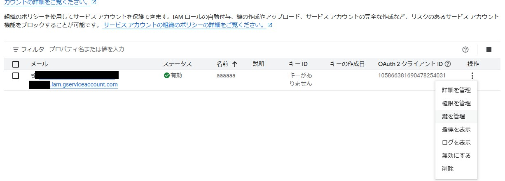
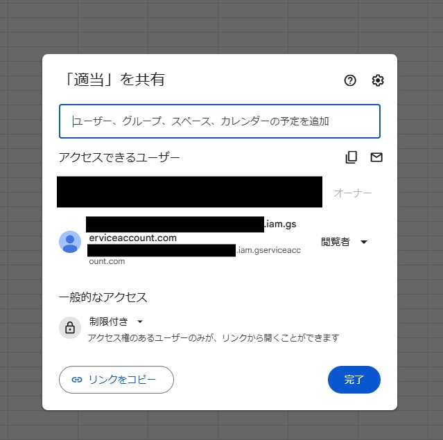
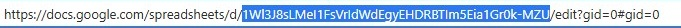

# godot-spreadsheet-access

godot engineからgoogle spread sheetを参照するためのアドオン

## 事前準備
1. (なければ)https://console.cloud.google.com/workspace-api/ から新しいプロジェクトを作成
2. `API`のメニューの`その他のAPI`から`Google Sheets API`を選択して有効にする
3. `APIとサービス>認証情報`から、`サービス アカウントを管理`を押す
4. `サービス アカウントを作成`を押してアカウント名とアカウントIDを入力し、サービスアカウントを作成する
5. `操作>鍵を管理`を押す  

6. `キーを追加>新しい鍵を作成`を押し、JSON形式で鍵を作成
7. 作成した鍵をダウンロードし、`addons/spreadsheet_to_csv/secret.json`としてアドオンの中にコピー
8. godotから参照したいスプレッドシートを開き、共有設定に4.で作成したサービスアカウントを閲覧者として追加する  

9. `addons/spreadsheet_to_csv/import_from_spreadsheet.gd`の`spreadsheet_id`に参照したいスプレッドシートのIDを入れ、rangeに参照したい範囲を入れる  
IDはここの値↓  

10. godotの`プロジェクト>ツール>スプレッドシートからデータをインポート`を押すと`addons/spreadsheet_to_csv/output.txt`に9.で指定したシートのデータが出力される